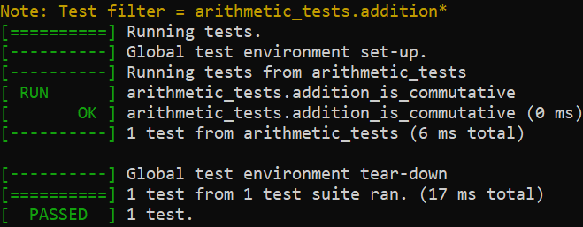

# Quick tour

Tests in R2K Test are defined with a `TEST()` macro, and the tests are defined inside of a function that becomes the test suite for those tests. These test suites are then ran by calling the corresponding functions from a test runner program.

The test runner program should start with a call to `r2k_test_start()` and end with returning the value of `r2k_test_end`. Calls to all test suites happen in between these two functions.

## Defining a test suite
Here's an example test runner program with a test suite `arithmetic_tests`:

```C
#include <r2k_test/r2k_test.h>

void arithmetic_tests(void) {
    TEST_SUITE_START();

    TEST(addition_is_commutative) {
        EXPECT_EQ(2 + 3, 3 + 2);
    }

    TEST(zero_is_additive_identity) {
        EXPECT_EQ(2 + 0, 2);
    }

    TEST_SUITE_END();
}

int main(int argc, char** argv) {
    r2k_test_start(argc, argv);

    arithmetic_tests();

    return r2k_test_end();
}
```

Running this on the command line gives an output that is very familiar to someone who's used Google Test:


Note that the function name `void arithmetic_tests(void)` gives the name of the test suite, as seen in e.g. the `arithmetic_tests.addition_is_commutative` output.

## Asserting in tests

We can tweak one of the tests so that it contains an error:

```C++
TEST(zero_is_additive_identity) {
    EXPECT_EQ(2 + 1, 2);
}
```

Running this prints out an error message with details like in Google Test:


## Disabling tests

Like in Google Test, a test case can be disabled by prefixing its name with `DISABLED_`:

```C++
TEST(DISABLED_addition_is_commutative) {
    EXPECT_EQ(2 + 3, 3 + 2);
}
```

This will behave in the same way as in Google Test when running the tests, where that case is now omitted, and a reminder text is printed at the end of the output that there are disabled tests:


## Filtering tests

By passing a `--test_filter=<pattern>` argument to the test runner program, only the test cases that fit the pattern will be ran. The `<pattern>` is a string that will be matched against the full name of the test case, where the full name is e.g. `arithmetic_tests.addition_is_commutative`. The pattern can contain a `*` wildcard, that makes the filter only prefix match.

Here's an example of running the test program with the `--test_filter=arithmetic_tests.addition*` argument:


