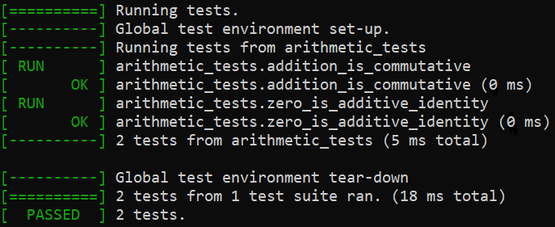

# R2K Test

A small test library for C programs, written to closely mimick [Google Test](https://github.com/google/googletest). This is intended as a library that is lightweight and easy to integrate into a C project to add testing capabilities.

Tests in R2K Test are defined with a `TEST()` macro, and the tests are defined inside of a function that becomes the test suite for the tests. These test suites are then ran by calling the corresponding functions from a test runner program.

```C
#include <r2k_test/r2k_test.h>

void arithmetic_tests() {
    TEST_SUITE_START();

    TEST(addition_is_commutative) {
        EXPECT_EQ(2 + 3, 3 + 2);
    }

    TEST(zero_is_additive_identity) {
        EXPECT_EQ(2 + 0, 2);
    }

    TEST_SUITE_END();
}

int main(int argc, char** argv) {
    r2k_test_start(argc, argv);

    arithmetic_tests();

    return r2k_test_end();
}
```

Running this on the command line gives an output that is very familiar to someone who's used Google Test:



Note that the function `void arithmetic_tests()` becomes the test suite name, as seen in e.g. the `arithmetic_tests.addition_is_commutative` output.

## Build instructions
(todo)

## Assertion macros
(todo)
